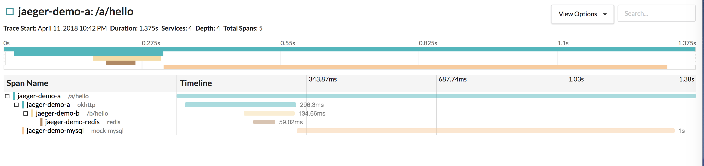
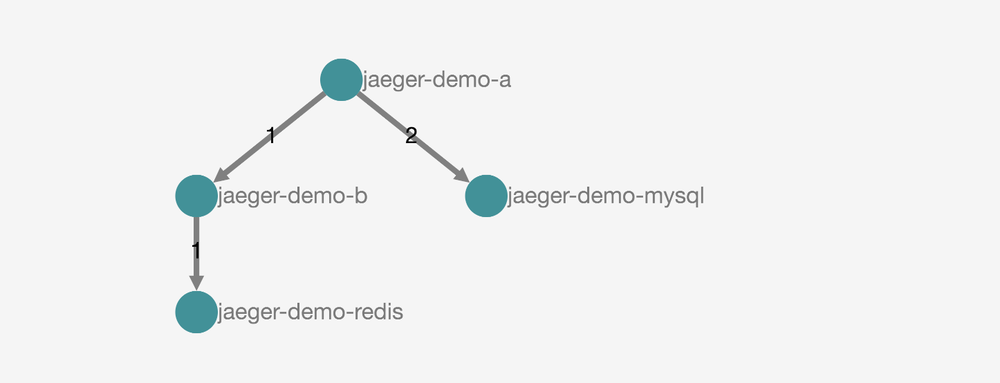

# jaeger-java-hello-world
> simple example for jaeger tracing system, easy to understand, easy to develop

this project is an example for [jaeger project](https://github.com/candyleer/jaeger-client-java)

#### why this project exist?
when i know about  jaeger, i have many question by how to start,how to understand these concepts in opentracing and jaeger
i remember that i follow the `nodejs` code to start the `java` code.
so i want to create these example to instruct some guys who need.

#### steps:

- download the jaeger environment by run docker command:
```bash
docker run -d -e \
  COLLECTOR_ZIPKIN_HTTP_PORT=9411 \
  -p 5775:5775/udp \
  -p 6831:6831/udp \
  -p 6832:6832/udp \
  -p 5778:5778 \
  -p 16686:16686 \
  -p 14268:14268 \
  -p 9411:9411 \
  jaegertracing/all-in-one:latest
``` 

this `all-in-one` docker will start three core component.`jaeger-agent`,`jaeger-collector`,`jaeger-query`
visit the web page by `http://localhost:16686`

- clone this project and run `jaeger-demo-a` and `jaeger-demo-b` by
```bash
 git clone https://github.com/candyleer/jaeger-java-hello-world.git
 
 cd jaeger-demo-a && mvn spring-boot:run
```
and start a new terminal to start `jaeger-demo-b`
```bash
 cd jaeger-demo-b && mvn spring-boot:run
```

- `curl` this url to generate trace info 
```bash
curl http://localhost:8080/a/hello
```
- then visit `http://localhost:16686` you will find some trace has been generated like this.

